# Crypto Wallet Update Automator Script
Wallet update script, based on the amount contributed in cryptocurrencies at https://www.okx.com/
## Restrictions

1. Have an OKX account (the script only integrates with OKX for now)
   - Note: you are expected to have all your cryptos allocated on OKX
2. Have a google account

## Steps

1. Install Python3 and Poetry
2. Run `poetry install`
3. Duplicate the following wallet to your drive: <https://docs.google.com/spreadsheets/d/1xfvUxD_1G1AENeGp2jEhN10qQSd7JnER1-Gr4hddyhA/edit?usp=sharing>
   - Note: change the cryptos in the wallet according to the cryptos you want your wallet to have (cryptos that do not have at least 1 dollar in the OKX will not be updated)
4. Create an API key for OKX account access (see [How To create a OKX API key?](#how-to-create-a-okx-api-key))
   - Note: provide the api access credentials in the .env file
5. Create Service Account for access to google drive and google sheets (see [How to Create a Google Service Account?](#how-to-create-a-google-service-account))
   - Note: make the json available with the access credentials in the file: data/google_client_secret.json
6. Run `python3 src/update_google_wallet_sheet.py`

7. Using Docker? run:
    ```
    wsl docker build -t att_crypto_wallet {project_folder}/.
    wsl docker run --env-file {project_folder}/.env -it att_crypto_wallet
    wsl docker rm -f $(docker ps -aqf "ancestor=att_crypto_wallet")
    ```

### How To create a OKX API key?
---
1. Log in to [https://www.okx.com/login](https://www.okx.com/login).
    
    **Note** OKX requires users to either link a mobile number to their account or enable an authenticator app like Google Authenticator before creating a API credentials.
    
2. Hover over the user icon and select **Security**.
   
    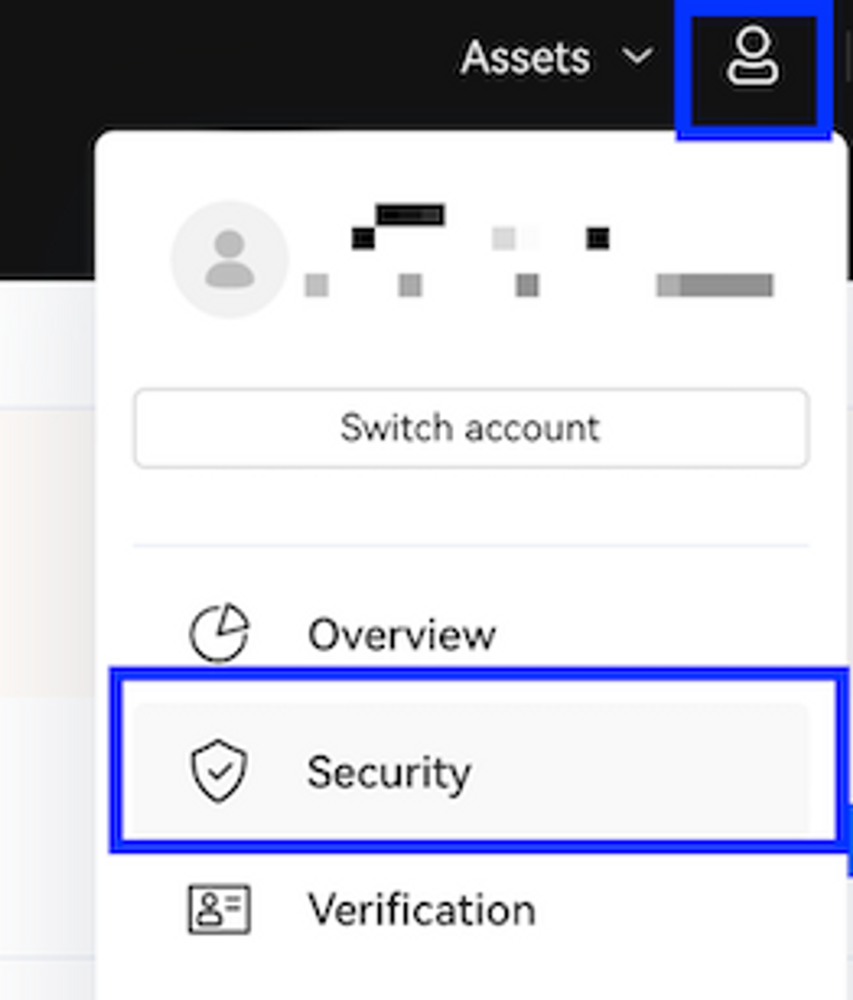
    
3. Press the **Select** button next to either the **Mobile Verification** or **Authenticator app** option and follow the onscreen instructions to complete the process.
4. Once enabled, select **API** from the top submenu and press the **Create V5 API Key** button.
    
    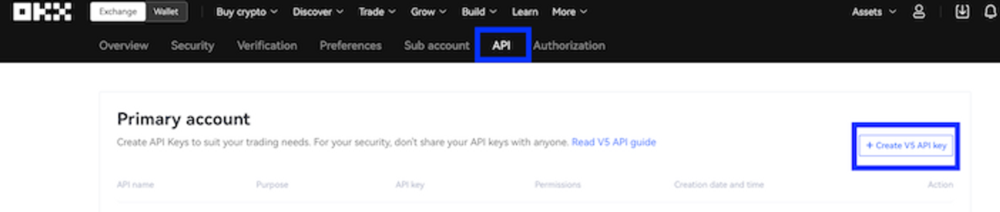
    
5. The API creation window appears.
6. Under **Purpose**, select **API trading**.
7. Enter a name for your API in the **API name** field.
8. Create a unique **Passphrase** and store it somewhere safe.
9.  Under **Permissions**, ensure you enable the checkbox next to **Trade**.
10. Press the **Confirm** button and enter the values for your Two-factor authentication.
11. Your API credentials appears.
12. Copy the API Key and Secret Key and store in a safe place. You will need both keys, and your unique Passphrase for [Adding a OKX Connection](https://library.tradingtechnologies.com/user-setup/okx-adding-a-okx-connection.html).

### How to Create a Google Service Account?
---
In order to read and update the data from google spreadsheets in python, we will have to create a [Service Account](https://cloud.google.com/iam/docs/service-accounts). It is a special type of account used to make authorized API calls to Google Cloud Services *– Google Cloud Docs*.

First of all, make sure that you have a google account. If you have a Google account, you can follow these steps to create a Google service account.

1.  Go to the [developer’s console.](https://console.developers.google.com/) Now, you will see something like this. Click on the Create Project button.

    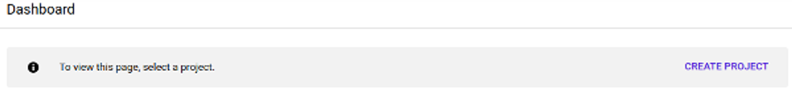

2.  Then provide the project name and the organization name, which is optional. Then click on the create button.

    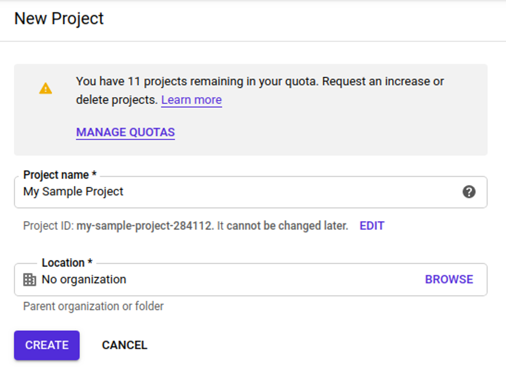

3.  Now that our project is created, we need to enable the APIs that we require in this project. Click on the Enable APIs and Services button to search for the APIs that Google provides.Consequently, we will add two APIs for our project.

    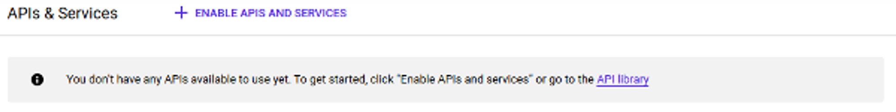

    *   Google Sheets API

    *   Google Drive API

4.  Then, in the search bar, search for these APIs and click on the enable button.

    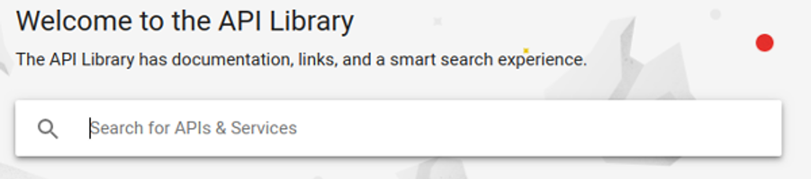

5.  Google Sheets API will look something like this. It will allow you to access Google Spreadsheets. You would be able to read and modify the content present in the Spreadsheets.Google Drive API will look something like this. It will allow you to access the resources from Google Drive.

    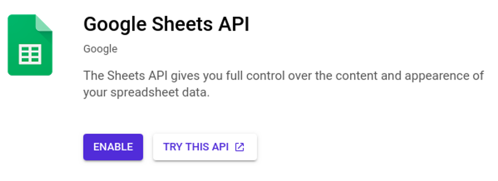

    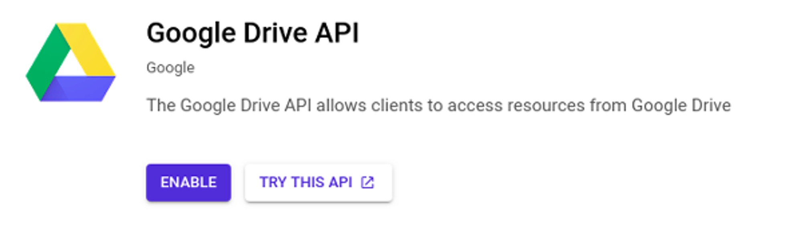

6.  Once you have enabled the required APIs in your project, then it’s time to create credentials for the service account. Click on the Create Credentials button to continue.

    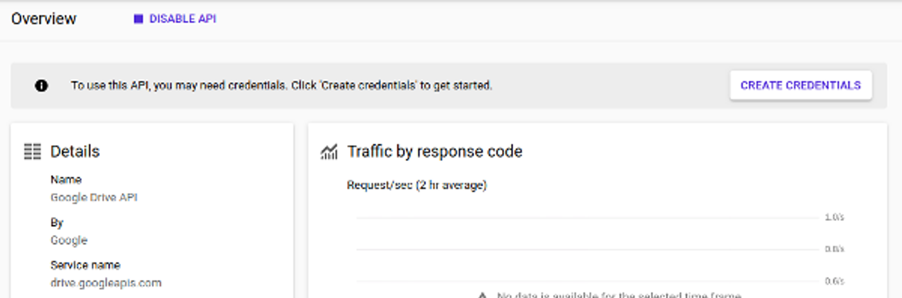

7.  Now, select Google Drive API in the type of **API required** question. We will call the API from a non-UI-based platform, so select **Other non-UI (e.g., cron job, daemon)**. Select the ‘**Application Data’** in the next question, as we do not require any user data to run our application. And also, we are not using any cloud-based computing engine for our application. Finally, click on the ‘**What credentials do I need?’** button.

    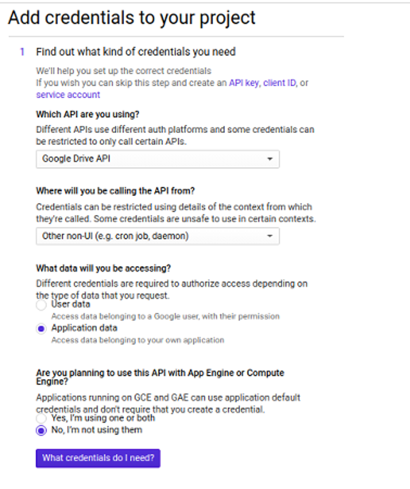

8.  Then, share the google spreadsheets with others and provide permission like edit or view only. Similarly, we will provide access to our service account. We will give it complete access so that we can read and write the spreadsheets and download the credentials.json file of the credentials.

    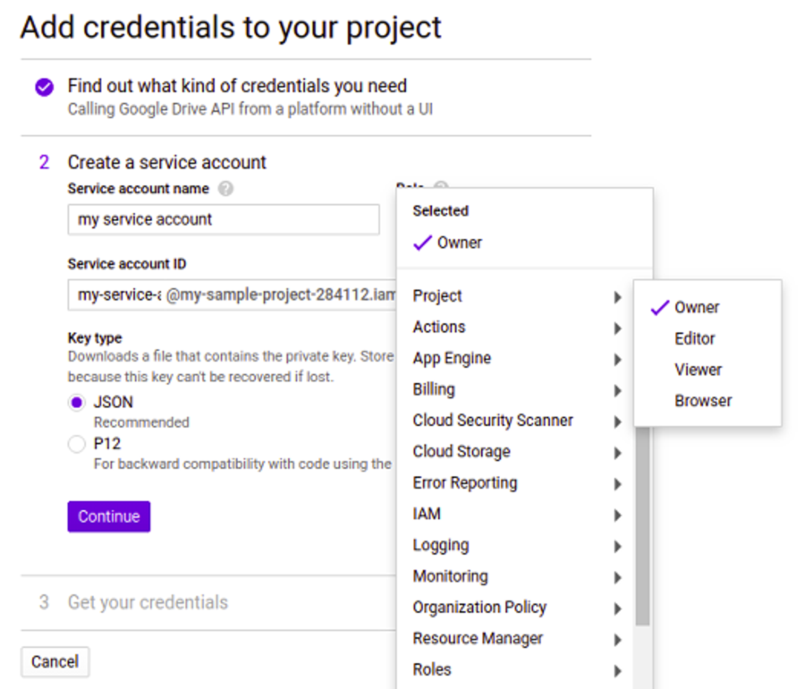

A JSON file will now be downloaded, containing the keys to access the API. Our google service account is ready to use. In the next section, we will read and modify the data in the google spreadsheet.
